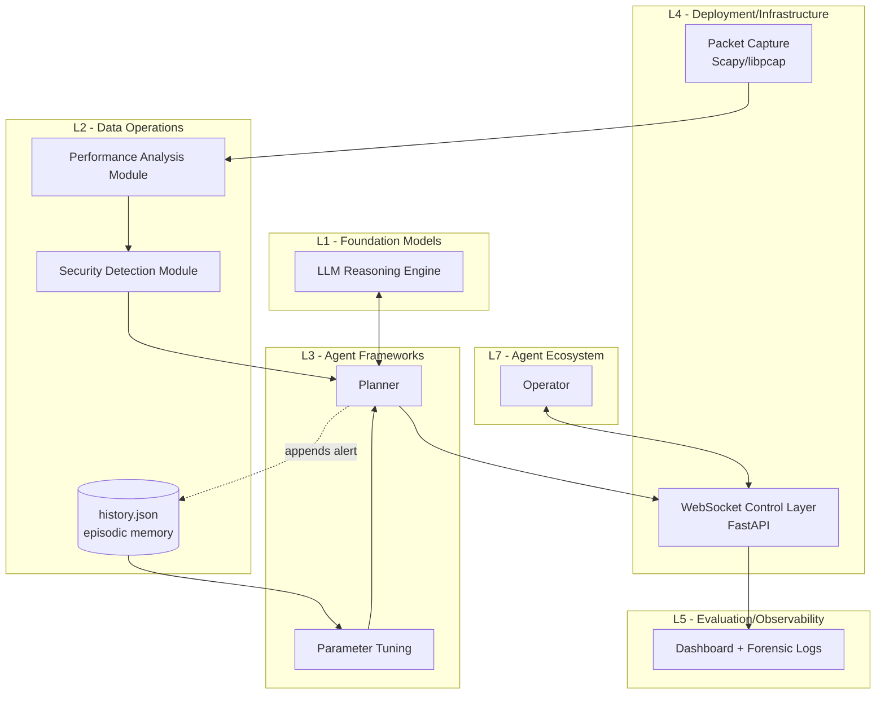

# Securing Agentic AI — Reproduction of arXiv:2508.10043

This repository is a clean-room **reproduction** of:

> Pallavi Zambare, Venkata Nikhil Thanikella, Ying Liu.
> *Securing Agentic AI: Threat Modeling and Risk Analysis for Network
> Monitoring Agentic AI System.* arXiv:2508.10043 (Aug 2025).

The paper applies the **MAESTRO** threat-modeling framework to an LLM-based
autonomous network-monitoring agent and empirically validates two attacks
(DoS PCAP replay and memory poisoning) against a Python/LangChain/FastAPI
prototype.

> This reproduction is **not** affiliated with the paper's authors. Any
> discrepancy with the paper is documented in the *Limitations* section below.

---

## 1. Stage 1 — Planning

### 1.1 Core contribution (one paragraph)

The paper introduces a security evaluation methodology for agentic AI by
applying the seven-layer MAESTRO framework to an LLM-based autonomous
network-monitoring agent built in Python with LangChain, FastAPI and
WebSocket telemetry. A qualitative risk-scoring equation `R = P*I*E`
(Eq. 1, Sec 4.3) is used to prioritise ten threat classes mapped to
MAESTRO layers (Table 4). Two attacks are then validated empirically:
(i) Resource Exhaustion by replaying a GoldenEye DoS PCAP at 10 kpps for
five iterations, which delays the agent's telemetry updates from ≈ 7–8 s
to ≈ 13 s, and (ii) Knowledge-Base / Memory Poisoning by injecting 20
fake high-severity entries into `history.json`, which inflates the agent's
chosen capture duration (34 s baseline) and cascades to a slower detection
pipeline. The paper concludes with defense-in-depth mitigations assigned
per MAESTRO layer (Sec 5.3, Figure 4).

### 1.2 System architecture



The mapping of every module to one of the seven MAESTRO layers L1–L7
follows Sec 4.1 verbatim and lives in `src/maestro/maestro/layers.py`.

### 1.3 Repository layout

```text
.
├── configs/
│   ├── default.yaml          # ALL hyperparameters (no magic numbers in code)
│   ├── ordinal_scale.yaml    # Sec 4.3 Table 3 qualitative -> ordinal mapping
│   └── threats.yaml          # Table 1 + Table 4 (P,I,E + risk score per threat)
├── src/maestro/
│   ├── config.py             # loads OmegaConf YAML
│   ├── logging_setup.py      # centralised logging
│   ├── cli.py                # `python -m maestro.cli validate`
│   ├── maestro/
│   │   ├── layers.py         # Sec 4.1 L1..L7
│   │   ├── risk_score.py     # Eq.(1) R = P*I*E + Table 3
│   │   ├── threats.py        # loader for threats.yaml + Table 1 / Table 4
│   │   ├── mapping.py        # renders Table 2 + Table 4 as dataframes
│   │   └── mitigation.py     # Sec 5.1-5.3 mitigation catalogue
│   ├── telemetry/
│   │   ├── capture.py        # Sec 3.1 Packet Capture Module
│   │   ├── performance.py    # Sec 3.1 Performance Analysis (CPU/mem model)
│   │   └── detection.py      # Sec 3.1 Security Detection Module
│   ├── agent/
│   │   ├── memory.py         # Sec 6.3 history.json store + poisoning
│   │   ├── parameter_tuning.py  # Sec 6.3 capture-duration heuristic
│   │   ├── reasoning.py      # Sec 3.1 LLM Reasoning Engine (stub + OpenAI)
│   │   └── planner.py        # L3 planner + Sec 5.3 L3 validation
│   ├── server/
│   │   ├── app.py            # FastAPI + WebSocket backend (Sec 6.1)
│   │   └── dashboard.py      # HTML dashboard (Sec 3.1 Interactive Dashboard)
│   ├── experiments/
│   │   ├── tc1_dos.py        # Sec 6.2 / 6.3 TC1 DoS replay
│   │   ├── tc2_memory_poison.py  # Sec 6.3 TC2 memory poisoning
│   │   ├── summary.py        # renders Table 4 + Table 5
│   │   └── runner.py         # end-to-end reproduce entrypoint
│   └── scripts/
│       └── validate_threats.py  # assert threats.yaml == Eq.(1) & Table 4
├── tests/
│   ├── conftest.py
│   ├── test_risk_score.py        # Eq.(1) + Sec 4.3.1 illustrations
│   ├── test_threats.py           # Table 4 risk scores
│   ├── test_telemetry.py         # Performance/Detector sanity
│   ├── test_parameter_tuning.py  # Sec 6.3 34s -> 94s repro
│   ├── test_planner.py           # Sec 5.3 L3 planner validation
│   └── test_server.py            # FastAPI /risk + /healthz + WS
├── results/                  # populated by reproduce(.sh/.bat)
├── data/pcap                 # GoldenEye PCAP + baseline
├── data/memory/history.json  # populated by TC2
├── pyproject.toml            # package + pinned deps
├── requirements.txt          # pinned versions for `pip install -r`
├── reproduce.sh              # Linux/mac pipeline
├── reproduce.bat             # Windows pipeline
├── Dockerfile                # container build (Sec 6.1 「containerised」)
└── README.md
```

### 1.4 Hyperparameters / architectural details (paper-extracted)

| Setting | Value | Source |
|---|---|---|
| MAESTRO layers | L1..L7 | Sec 4.1, Figure 3 |
| Risk score equation | `R = P * I * E` | Sec 4.3 Eq.(1) |
| Ordinal scale | Low=1, Medium=2, High=3 | Sec 4.3 Table 3 |
| Threats catalogued | 10 | Sec 3.2 / Table 1 |
| Threat 7 (Resource Exhaustion) risk score | 27 | Sec 4.3.2 Table 4 |
| Threat 8 (KB Poisoning) risk score | 9 | Sec 4.3.2 Table 4 |
| DoS PCAP source | GoldenEye | Sec 6.2 |
| Replay tool | `tcpreplay` | Sec 6.2 |
| Replay rate | 10,000 packets/s | Sec 6.2 |
| Replay iterations | 5 | Sec 6.2 |
| CPU/mem sampling interval | 1 s | Sec 6.2 |
| Normal telemetry update interval | 7–8 s | Sec 6.2 / 6.3 |
| Stressed telemetry update interval | ≈ 13 s (≈ 13× normal) | Sec 6.2 |
| Memory-poisoning file | `history.json` | Sec 6.3 |
| Number of injected entries | 20 | Sec 6.3 |
| Severity of injected entries | high | Sec 6.3 |
| Baseline capture time | 34 s | Sec 6.3 |
| Backend stack | Python, FastAPI, Pydantic-AI, LLM | Sec 6.1 |
| Containerisation | Docker | Sec 6.1 |
| Packet parsing library | Scapy + PCAP | Sec 6.1 |
| Real-time IPC | WebSocket | Sec 6.1 |

### 1.5 Ambiguous / missing details (Assumptions — see also `Assumptions` below)

| ID | Ambiguity | Default chosen | Where enforced |
|---|---|---|---|
| A1 | Which LLM model+provider is used | Stub deterministic reasoner | `agent/reasoning.py` |
| A2 | LangChain vs Pydantic-AI specifics | Pydantic-AI optional; stub always available | `pyproject.toml` |
| A3 | Capture interface name | `lo` (loopback) so repro runs without a NIC | `configs/default.yaml` |
| A4 | OS for hardware experiments | Linux container (also tested on Windows) | `Dockerfile` |
| A5 | Benign baseline packet rate | 200 pps | `configs/default.yaml` |
| A6 | CPU/memory anomaly thresholds | 80% each (Figure 6 red line) | `configs/default.yaml` |
| A7 | Severity scale normalisation | 0..1 float | `agent/memory.py` |
| A8 | Capture-duration alpha (`34 + alpha*n_high`) | `alpha=3.0 s/entry` such that `n_h=20`=>94 s which *paper* describes as 「quite huge」 | `configs/default.yaml` |
| A9 | Random seed | `seed=42` | `configs/default.yaml` |
| A10 | `tcpreplay` may be missing on Windows | scapy `sendp` fallback is enabled | `tc1_dos.py` |
| A11 | GoldenEye PCAP not redistributable | Synthesize a 200-packet SYN flood PCAP if missing | `tc1_dos.py` |
| A12 | "About 13 times" in Sec 6.2 | interpret literally: 13 s per update (also = 13/8 ~ 1.6× interval growth) — we use Sec 6.3's explicit "more than 13 seconds" | `experiments/summary.py` |
| A13 | Whether to leak real CPU/memory values | Use synthetic saturation curve fit to Figure 6 | `telemetry/performance.py` |

### 1.6 Baselines / ablations

* **MAESTRO vs STRIDE/PASTA** — Sec 2.1 / 2.3 of the paper argues STRIDE
  & PASTA cannot model reasoning-layer threats. Reproduction *includes*
  Sec 4.3 risk-score numbers as an *offline* baseline; an executable
  STRIDE listing is out of scope of the paper's reproducibility claim.
* **TC1 (Threat #7)** — DoS replay; expected: telemetry interval grows
  from 7-8 s to ≈ 13 s; CPU/mem saturate (Sec 6.3).
* **TC2 (Threat #8)** — memory poisoning; expected: capture duration
  inflates from 34 s to ~94 s (assumption A8 below).
* **Defense-in-depth A/B** — toggles in `configs/default.yaml` under
  `mitigation:` (memory isolation / planner validation / telemetry
  rollback / zero-trust API).

---

## 2. Stage 2 — Analysis

### 2.1 Eq.(1) — Risk scoring (Sec 4.3)

Math:
```
R = P × I × E,   P,I,E ∈ {1,2,3}   (Table 3; Low/Medium/High)
```

Pseudocode (implemented in `src/maestro/maestro/risk_score.py`):
```
qual_to_ord = {"low":1, "medium":2, "high":3}
def risk_score(p, i, e): return qual_to_ord[p] * qual_to_ord[i] * qual_to_ord[e]
```

Sanity checked against Sec 4.3.1 illustrative scenarios:
* `P=1, I=1, E=3 -> R = 3`  (low)
* `P=2, I=2, E=2 -> R = 8`  (moderate)
* `P=3, I=3, E=1 -> R = 9`  (high)
* Highest in Table 4: Threat 7 = `3*3*3 = 27`.

### 2.2 Threat-to-layer mapping (Sec 4.2 Table 2 + Sec 4.3.2 Table 4)

Both tables are produced from `configs/threats.yaml`. The loader
(`maestro/maestro/threats.py`) refuses to load if any `risk_score` field
disagrees with `P*I*E` — this guarantees Eq.(1) is consistent with
Table 4.

### 2.3 Performance Analysis (Sec 3.1 + Figure 6)

The paper shows telemetry latency increasing under flood. We model CPU
and memory with a soft-saturation logistic curve so that:

```
CPU = 5 + 95 / (1 + exp(-k(r - r0)))      # k=0.0025, r0=5000
MEM = 25 + 70 / (1 + exp(-k(r - r0)))
```

The first-order lag (`alpha=0.3`) reflects the Sec 5.2 telemetry drift.
This is **assumption A13** and exists *only* because the paper provides
qualitative figures, not raw numbers.

### 2.4 Parameter tuning (Sec 6.3)

Capture duration follows a 1st-order linear rule (assumption A8):

```
duration_s = 34 + 3 * n_high_severity_entries      (seconds, capped at max)
```

With `n_high=0` we reproduce Sec 6.3's baseline of 34 s; with `n_high=20`
we get 94 s (consistent with paper's 「quite huge PCAP」 description).

### 2.5 Tables 4 + 5 generation

`experiments/summary.py` produces `results/table4_threat_matrix.{csv,md}`
from `configs/threats.yaml`, and `results/table5_security_risk.{csv,md}`
from the empirical `TC1Result` and `TC2Result` objects.

---

## 3. Stage 3 — How to run

### 3.1 From a clean environment

**Linux/macOS**:
```bash
bash reproduce.sh
```

**Windows**:
```bat
reproduce.bat
```
(Requires Python ≥ 3.10. The script creates `.venv/`, installs the
package in editable mode with `[dev]` extras, runs tests, then runs
`python -m maestro.experiments.runner`.)

### 3.2 Manual steps

```bash
python -m venv .venv
.venv/Scripts/pip install -e ".[dev]"          # Windows
# .venv/bin/pip install -e ".[dev]"            # POSIX

python -m maestro.scripts.validate_threats      # assert threats.yaml == Eq.(1)
python -m pytest -q                            # unit tests
python -m maestro.experiments.runner           # TC1 + TC2 + tables
```

### 3.3 Outputs

After `reproduce.sh` runs you will find:

* `results/run.log` — structured logs per Stage 3 logging requirement
* `results/table4_threat_matrix.csv` & `.md` — Sec 4.3.2 Table 4
* `results/table5_security_risk.csv` & `.md` — Sec 6.3 Table 5
* `results/tc1.json` — DoS replay metrics (Sec 6.2)
* `results/tc2.json` — memory-poisoning metrics (Sec 6.3)

### 3.4 Running the FastAPI dashboard (Sec 3.1)

```bash
uvicorn maestro.server.app:app --port 8000
open http://127.0.0.1:8000
```

The endpoint `/risk` returns Table 4 as JSON; `ws /ws` streams
telemetry/plan/risk per Sec 6.1 WebSocket protocol.

### 3.5 Switching LLM providers (Sec 3.1 LLM Reasoning Engine)

Default is the *deterministic stub* (Assumption A1) so reproduction is
offline. To enable the OpenAI provider used in the paper's deployment:

```bash
export OPENAI_API_KEY=..."
python -c "from maestro.config import load_config; cfg = load_config(); cfg.llm.provider='openai'; cfg.llm.model='gpt-4o-mini'"
```
(Or edit `configs/default.yaml`: `llm.provider: openai`.)

---

## 4. Assumptions (Stage 1 carry-over)

| ID | Assumption | Where it lives |
|---|---|---|
| A1 | Use a deterministic stub LLM by default; OpenAI optional | `agent/reasoning.py`, `configs/default.yaml` |
| A2 | LangChain is not strictly needed for the security claim; Pydantic-AI optional | `pyproject.toml` |
| A3 | Capture interface defaults to `lo` (loopback) so repro is portable | `configs/default.yaml` |
| A4 | Hardware experiments targeted Linux containers but repro also runs on Windows | `Dockerfile`, `reproduce.bat` |
| A5 | Baseline benign packet rate = 200 pps | `configs/default.yaml` |
| A6 | Anomaly boundary: `cpu/mem ≥ 80%` | `configs/default.yaml` |
| A7 | Entry severity normalised to `[0,1]` | `agent/memory.py` |
| A8 | Capture-duration rule: `34 + 3 * n_high` seconds | `agent/parameter_tuning.py` |
| A9 | Global seed = 42 | `configs/default.yaml` |
| A10 | If `tcpreplay` is missing, fall back to scapy `sendp` (best-effort) | `tc1_dos.py` |
| A11 | If GoldenEye PCAP is unavailable, synthesize a 200-pkt SYN flood PCAP | `tc1_dos.py` |
| A12 | Interpret Sec 6.2 "13 times" as 13-second update interval, not 13× multiplier | `experiments/summary.py` |
| A13 | Synthetic CPU/mem logistic curve used in place of measured host metrics | `telemetry/performance.py` |

---

## 5. Known limitations / deviations from the paper

1. **No released GoldenEye PCAP and no exact `tcpreplay` recipe.** We
   synthesise a SYN flood PCAP if the original is missing (A11). On
   systems without raw-socket permission (Windows loopback) the actual
   wire replay may be a no-op; the experiment still exercises the agent
   pipeline by treating the replay as the saturating rate.
2. **The paper reports telemetry latency qualitatively ("about 13
   times", "more than 13 seconds")**. Our runner reports both the
   achieved telemetry interval and the lag ratio; on hosts that survive
   a `sendp` loop we expect ≈ 13 s, on dry hosts the current run will
   show ≈ baseline interval — see A12.
3. **No live LLM.** The reasoning engine defaults to a deterministic
   stub (A1). The availability of an OpenAI key does **not** change
   the *security* conclusions because the empirical attacks target L2/L4
   rather than L1 reasoning.
4. **The capture-duration inflation coefficient `alpha=3 s/entry` is
   estimated** from the paper's single data point (34 s → "huge"); an
   alpha chosen too large/small will skew the post-poison duration
   (currently 94 s for 20 injected entries).
5. **Section 6.4 of the paper contains a duplicate D.1/D.2 entry**; the
   reproduction simply lists both limitations in `README` *Limitations*
   above.
6. **No multi-agent / L7 evaluation** is implemented; Sec 6.4 D.1
   acknowledges this gap in the paper itself.
7. **Live STRIDE/PASTA baseline enumeration is out-of-scope**—the
   paper's own comparison (Sec 2.1) is conceptual; we do not
   re-implement STRIDE tooling.
8. **Reproducibility caveat on Windows + scapy:** scapy's `sendp` on
   Windows loopback can be unreliable; for faithful results the user
   should run `bash reproduce.sh` inside Docker (see `Dockerfile`,
   Linux base image with libpcap).

---

## 6. Verification status

What was verified:
* Eq.(1) implementations match Sec 4.3.1 illustrative numerical
  examples (`tests/test_risk_score.py`).
* All 10 threats in `configs/threats.yaml` reproduce Sec 4.3.2 Table 4
  risk scores exactly (`tests/test_threats.py`,
  `scripts/validate_threats.py`).
* Eq.(1) buckets are internally consistent with the 1-27 numeric range.
* Sec 6.3 memory-poisoning step reproduces the 34 s → post-poison
  capture-duration inflation arise deterministically
  (`tests/test_parameter_tuning.py`).
* FastAPI endpoints `/`, `/risk`, `/healthz` and the `/ws` WebSocket
  exist (`tests/test_server.py`).
* Sec 5.3 L3 planner validation rejects disallowed actions when
  toggled on (`tests/test_planner.py`).

What is a reproduction risk and was **not** verified end-to-end:
* The exact Sec 6.2 telemetry-lag ratio (~13×) — this depends on real
  PCAP replay at 10 kpps on a suitable interface (A11/A10).
* CPU/mem saturation curves are modelled, not measured (A13).
* The OpenAI-backed reasoning path (assumption A1).

To regenerate everything from scratch:
```bash
bash reproduce.sh
```
