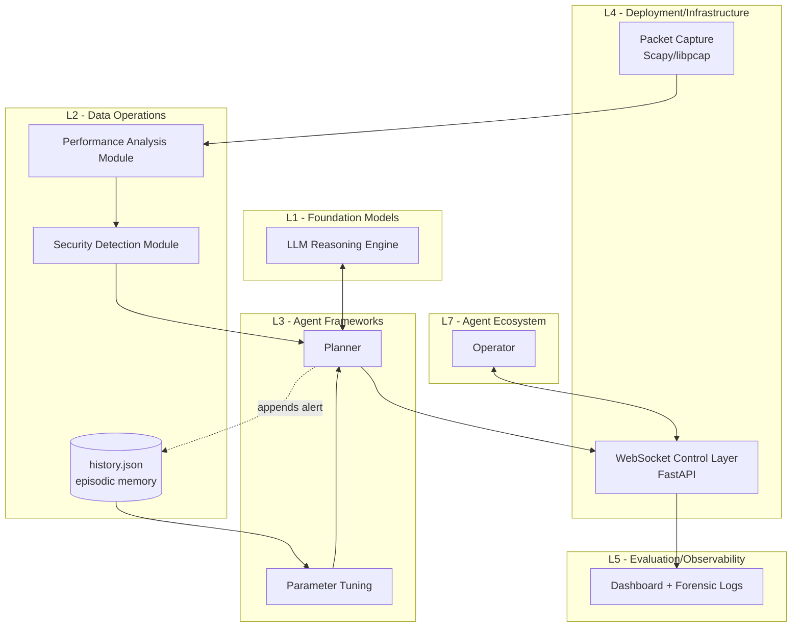

# Securing Agentic AI — Reproduction of arXiv:2508.10043

This repository is a clean-room **reproduction** of:

> Pallavi Zambare, Venkata Nikhil Thanikella, Ying Liu.
> *Securing Agentic AI: Threat Modeling and Risk Analysis for Network
> Monitoring Agentic AI System.* arXiv:2508.10043 (Aug 2025).

The paper applies the **MAESTRO** threat-modeling framework to an LLM-based
autonomous network-monitoring agent and empirically validates two attacks
(DoS PCAP replay and memory poisoning) against a Python/LangChain/FastAPI
prototype.

> This reproduction is **not** affiliated with the paper's authors. Any
> discrepancy with the paper is documented in the *Limitations* section below.

---

## 0. Overview — what's in this repository

This began as a clean-room paper reproduction and has grown into three layers
that build on it:

| Layer | What it is | Docs |
|---|---|---|
| **1. Paper reproduction** | The 7-layer MAESTRO threat model, `R = P × I × E` risk scoring, and the two validated attacks (TC1 DoS, TC2 memory poisoning). | this README (Stages 1–3) |
| **2. Model connector system** | A provider-agnostic LLM abstraction (OpenAI, Anthropic, Ollama/local, custom) with graceful fallback, a registry, and a web testing dashboard at **`/playground`**. The agent routes all LLM calls through it. | [`docs/CONNECTORS.md`](docs/CONNECTORS.md) |
| **3. MAESTRO-SecOps security layer** | The repositioning toward a *security control plane*: an operational residual-risk engine and a Phase-0 "truth audit" that honestly classifies every control as declared/implemented/enforced/tested/verified. | [`docs/SECOPS.md`](docs/SECOPS.md) |

A comparison with other "MAESTRO"-named projects and the full security roadmap
are in [`MAESTRO_COMPARISON.md`](MAESTRO_COMPARISON.md).

> **Provenance (be precise):** the reproduced work is an **arXiv preprint** —
> not described here as peer-reviewed unless a named venue is verified. The
> seven-layer MAESTRO taxonomy is the **Cloud Security Alliance's** framework
> (Multi-Agent Environment, Security, Threat, Risk & Outcome; Huang, CSA 2025)
> that the paper *cites and uses* — our L1–L7 are CSA MAESTRO's layers, not an
> original taxonomy.

**Status:** 166 tests pass · `ruff` + `mypy` clean · reproduce pipeline +
connector + security suites all green (see §6). Everything works **offline with
no API key** (deterministic stub default).

---

## 1. Stage 1 — Planning

### 1.1 Core contribution (one paragraph)

The paper introduces a security evaluation methodology for agentic AI by
applying the seven-layer MAESTRO framework to an LLM-based autonomous
network-monitoring agent built in Python with LangChain, FastAPI and
WebSocket telemetry. A qualitative risk-scoring equation `R = P*I*E`
(Eq. 1, Sec 4.3) is used to prioritise ten threat classes mapped to
MAESTRO layers (Table 4). Two attacks are then validated empirically:
(i) Resource Exhaustion by replaying a GoldenEye DoS PCAP at 10 kpps for
five iterations, which delays the agent's telemetry updates from ≈ 7–8 s
to ≈ 13 s, and (ii) Knowledge-Base / Memory Poisoning by injecting 20
fake high-severity entries into `history.json`, which inflates the agent's
chosen capture duration (34 s baseline) and cascades to a slower detection
pipeline. The paper concludes with defense-in-depth mitigations assigned
per MAESTRO layer (Sec 5.3, Figure 4).

### 1.2 System architecture



The mapping of every module to one of the seven MAESTRO layers L1–L7
follows Sec 4.1 verbatim and lives in `src/maestro/maestro/layers.py`.

### 1.3 Repository layout

```text
.
├── configs/
│   ├── default.yaml          # ALL reproduction hyperparameters (no magic numbers)
│   ├── ordinal_scale.yaml    # Sec 4.3 Table 3 qualitative -> ordinal mapping
│   ├── threats.yaml          # Table 1 + Table 4 (P,I,E + risk score per threat)
│   └── connectors.yaml       # model-connector registry (keys via api_key_env)
├── src/maestro/
│   ├── config.py             # loads OmegaConf YAML
│   ├── logging_setup.py      # centralised logging
│   ├── cli.py                # console entry points
│   ├── maestro/              # ── Layer 1: paper reproduction ──
│   │   ├── layers.py         # Sec 4.1 L1..L7 (CSA MAESTRO)
│   │   ├── risk_score.py     # Eq.(1) R = P*I*E + Table 3 (legacy score, kept)
│   │   ├── threats.py        # loader for threats.yaml + Table 1 / Table 4
│   │   ├── mapping.py        # renders Table 2 + Table 4 as dataframes
│   │   └── mitigation.py     # Sec 5.1-5.3 mitigation catalogue
│   ├── telemetry/            # Sec 3.1 capture / performance / detection
│   ├── agent/
│   │   ├── memory.py         # Sec 6.3 history.json store + poisoning
│   │   ├── parameter_tuning.py  # Sec 6.3 capture-duration heuristic
│   │   ├── reasoning.py      # StubReasoner + ConnectorReasoner (routes via connector)
│   │   └── planner.py        # L3 planner + Sec 5.3 L3 validation
│   ├── experiments/          # TC1 DoS, TC2 memory poison, summary, runner
│   ├── scripts/validate_threats.py  # assert threats.yaml == Eq.(1) & Table 4
│   ├── connectors/           # ── Layer 2: model connector system ──
│   │   ├── base.py           # ModelConnector, ChatRequest/Response, errors
│   │   ├── registry.py       # register / enable / disable / resolve
│   │   ├── fallback.py       # FallbackConnector (graceful degradation)
│   │   ├── config.py         # build_registry() from configs/connectors.yaml
│   │   └── providers/        # stub, openai, anthropic, ollama, custom (+SSRF guard)
│   ├── security/             # ── Layer 3: MAESTRO-SecOps ──
│   │   ├── risk_engine.py    # operational residual-risk model + risk->action
│   │   ├── control_status.py # Phase-0 truth audit (declared..verified)
│   │   └── audit.py          # `maestro-audit` CLI (CI-gating)
│   └── server/
│       ├── app.py            # FastAPI + WebSocket backend (Sec 6.1)
│       ├── dashboard.py      # MAESTRO risk dashboard (Sec 3.1)
│       ├── connectors_api.py # /api model-testing REST router (opt-in auth)
│       └── playground.py     # /playground connector testing dashboard
├── tests/                    # 166 tests: reproduction + connectors + security
├── docs/
│   ├── CONNECTORS.md         # connector system: usage, add-a-provider, checklist
│   └── SECOPS.md             # security control-plane direction + status + roadmap
├── results/                  # populated by the reproduce pipeline + audit CLI
├── data/                     # pcap (synthesised) + memory/history.json
├── .github/workflows/ci.yml  # lint · type · test · validate · reproduce
├── pyproject.toml            # package + deps + console scripts
├── requirements.txt          # pinned versions for `pip install -r`
├── reproduce.sh / .bat       # Linux/mac + Windows pipelines
├── Dockerfile / .dockerignore
├── MAESTRO_COMPARISON.md     # vs other "MAESTRO" projects + security roadmap
└── README.md
```

### 1.4 Hyperparameters / architectural details (paper-extracted)

| Setting | Value | Source |
|---|---|---|
| MAESTRO layers | L1..L7 | Sec 4.1, Figure 3 |
| Risk score equation | `R = P * I * E` | Sec 4.3 Eq.(1) |
| Ordinal scale | Low=1, Medium=2, High=3 | Sec 4.3 Table 3 |
| Threats catalogued | 10 | Sec 3.2 / Table 1 |
| Threat 7 (Resource Exhaustion) risk score | 27 | Sec 4.3.2 Table 4 |
| Threat 8 (KB Poisoning) risk score | 9 | Sec 4.3.2 Table 4 |
| DoS PCAP source | GoldenEye | Sec 6.2 |
| Replay tool | `tcpreplay` | Sec 6.2 |
| Replay rate | 10,000 packets/s | Sec 6.2 |
| Replay iterations | 5 | Sec 6.2 |
| CPU/mem sampling interval | 1 s | Sec 6.2 |
| Normal telemetry update interval | 7–8 s | Sec 6.2 / 6.3 |
| Stressed telemetry update interval | ≈ 13 s (≈ 13× normal) | Sec 6.2 |
| Memory-poisoning file | `history.json` | Sec 6.3 |
| Number of injected entries | 20 | Sec 6.3 |
| Severity of injected entries | high | Sec 6.3 |
| Baseline capture time | 34 s | Sec 6.3 |
| Backend stack | Python, FastAPI, Pydantic-AI, LLM | Sec 6.1 |
| Containerisation | Docker | Sec 6.1 |
| Packet parsing library | Scapy + PCAP | Sec 6.1 |
| Real-time IPC | WebSocket | Sec 6.1 |

### 1.5 Ambiguous / missing details (Assumptions — see also `Assumptions` below)

| ID | Ambiguity | Default chosen | Where enforced |
|---|---|---|---|
| A1 | Which LLM model+provider is used | Stub deterministic reasoner | `agent/reasoning.py` |
| A2 | LangChain vs Pydantic-AI specifics | Pydantic-AI optional; stub always available | `pyproject.toml` |
| A3 | Capture interface name | `lo` (loopback) so repro runs without a NIC | `configs/default.yaml` |
| A4 | OS for hardware experiments | Linux container (also tested on Windows) | `Dockerfile` |
| A5 | Benign baseline packet rate | 200 pps | `configs/default.yaml` |
| A6 | CPU/memory anomaly thresholds | 80% each (Figure 6 red line) | `configs/default.yaml` |
| A7 | Severity scale normalisation | 0..1 float | `agent/memory.py` |
| A8 | Capture-duration alpha (`34 + alpha*n_high`) | `alpha=3.0 s/entry` such that `n_h=20`=>94 s which *paper* describes as 「quite huge」 | `configs/default.yaml` |
| A9 | Random seed | `seed=42` | `configs/default.yaml` |
| A10 | `tcpreplay` may be missing on Windows | scapy `sendp` fallback is enabled | `tc1_dos.py` |
| A11 | GoldenEye PCAP not redistributable | Synthesize a 200-packet SYN flood PCAP if missing | `tc1_dos.py` |
| A12 | "About 13 times" in Sec 6.2 | interpret literally: 13 s per update (also = 13/8 ~ 1.6× interval growth) — we use Sec 6.3's explicit "more than 13 seconds" | `experiments/summary.py` |
| A13 | Whether to leak real CPU/memory values | Use synthetic saturation curve fit to Figure 6 | `telemetry/performance.py` |

### 1.6 Baselines / ablations

* **MAESTRO vs STRIDE/PASTA** — Sec 2.1 / 2.3 of the paper argues STRIDE
  & PASTA cannot model reasoning-layer threats. Reproduction *includes*
  Sec 4.3 risk-score numbers as an *offline* baseline; an executable
  STRIDE listing is out of scope of the paper's reproducibility claim.
* **TC1 (Threat #7)** — DoS replay; expected: telemetry interval grows
  from 7-8 s to ≈ 13 s; CPU/mem saturate (Sec 6.3).
* **TC2 (Threat #8)** — memory poisoning; expected: capture duration
  inflates from 34 s to ~94 s (assumption A8 below).
* **Defense-in-depth A/B** — toggles in `configs/default.yaml` under
  `mitigation:` (memory isolation / planner validation / telemetry
  rollback / zero-trust API).

---

## 2. Stage 2 — Analysis

### 2.1 Eq.(1) — Risk scoring (Sec 4.3)

Math:
```
R = P × I × E,   P,I,E ∈ {1,2,3}   (Table 3; Low/Medium/High)
```

Pseudocode (implemented in `src/maestro/maestro/risk_score.py`):
```
qual_to_ord = {"low":1, "medium":2, "high":3}
def risk_score(p, i, e): return qual_to_ord[p] * qual_to_ord[i] * qual_to_ord[e]
```

Sanity checked against Sec 4.3.1 illustrative scenarios:
* `P=1, I=1, E=3 -> R = 3`  (low)
* `P=2, I=2, E=2 -> R = 8`  (moderate)
* `P=3, I=3, E=1 -> R = 9`  (high)
* Highest in Table 4: Threat 7 = `3*3*3 = 27`.

### 2.2 Threat-to-layer mapping (Sec 4.2 Table 2 + Sec 4.3.2 Table 4)

Both tables are produced from `configs/threats.yaml`. The loader
(`maestro/maestro/threats.py`) refuses to load if any `risk_score` field
disagrees with `P*I*E` — this guarantees Eq.(1) is consistent with
Table 4.

### 2.3 Performance Analysis (Sec 3.1 + Figure 6)

The paper shows telemetry latency increasing under flood. We model CPU
and memory with a soft-saturation logistic curve so that:

```
CPU = 5 + 95 / (1 + exp(-k(r - r0)))      # k=0.0025, r0=5000
MEM = 25 + 70 / (1 + exp(-k(r - r0)))
```

The first-order lag (`alpha=0.3`) reflects the Sec 5.2 telemetry drift.
This is **assumption A13** and exists *only* because the paper provides
qualitative figures, not raw numbers.

### 2.4 Parameter tuning (Sec 6.3)

Capture duration follows a 1st-order linear rule (assumption A8):

```
duration_s = 34 + 3 * n_high_severity_entries      (seconds, capped at max)
```

With `n_high=0` we reproduce Sec 6.3's baseline of 34 s; with `n_high=20`
we get 94 s (consistent with paper's 「quite huge PCAP」 description).

### 2.5 Tables 4 + 5 generation

`experiments/summary.py` produces `results/table4_threat_matrix.{csv,md}`
from `configs/threats.yaml`, and `results/table5_security_risk.{csv,md}`
from the empirical `TC1Result` and `TC2Result` objects.

---

## 3. Stage 3 — How to run

### 3.1 From a clean environment

**Linux/macOS**:
```bash
bash reproduce.sh
```

**Windows**:
```bat
reproduce.bat
```
(Requires Python ≥ 3.10. The script creates `.venv/`, installs the
package in editable mode with `[dev]` extras, runs tests, then runs
`python -m maestro.experiments.runner`.)

### 3.2 Manual steps

```bash
python -m venv .venv
.venv/Scripts/pip install -e ".[dev]"          # Windows
# .venv/bin/pip install -e ".[dev]"            # POSIX

python -m maestro.scripts.validate_threats      # assert threats.yaml == Eq.(1)
python -m pytest -q                            # unit tests
python -m maestro.experiments.runner           # TC1 + TC2 + tables
```

### 3.3 Outputs

After `reproduce.sh` runs you will find:

* `results/run.log` — structured logs per Stage 3 logging requirement
* `results/table4_threat_matrix.csv` & `.md` — Sec 4.3.2 Table 4
* `results/table5_security_risk.csv` & `.md` — Sec 6.3 Table 5
* `results/tc1.json` — DoS replay metrics (Sec 6.2)
* `results/tc2.json` — memory-poisoning metrics (Sec 6.3)

### 3.4 Running the FastAPI dashboard (Sec 3.1)

```bash
uvicorn maestro.server.app:app --port 8000
open http://127.0.0.1:8000
```

The endpoint `/risk` returns Table 4 as JSON; `ws /ws` streams
telemetry/plan/risk per Sec 6.1 WebSocket protocol.

### 3.4b Model connector system + testing playground

The same server hosts a **provider-agnostic model connector system** and a web
dashboard to configure, test, log, and verify agent behavior across LLM backends
(OpenAI, Anthropic, Ollama/local, and custom external providers), online and
offline. Open the dashboard at **`/playground`**:

```bash
uvicorn maestro.server.app:app --port 8000
# → http://127.0.0.1:8000/playground   (dashboard)
#   http://127.0.0.1:8000/api/...       (REST API)
```

It works offline with no API key (deterministic stub is the default). The
framework routes LLM calls through the connector via `ConnectorReasoner` (no
direct provider SDK calls). The dashboard lets you register/enable/disable
connectors, run prompts with live parameter control, compare backends
side-by-side, log requests with latency/token metrics, tick manual verification
checkmarks, and save/replay test cases. Full guide, add-a-provider instructions,
security notes, and the pre-deployment checklist:
**[`docs/CONNECTORS.md`](docs/CONNECTORS.md)**.

Use it as a library too:

```python
from maestro.connectors import build_registry, ChatRequest
r = build_registry().resolve().chat(ChatRequest.of("hello", max_tokens=32))
print(r.text, r.provider, r.latency_ms, r.usage.total_tokens)
```

### 3.4c Security control plane (MAESTRO-SecOps)

Run the **Phase-0 truth audit** — it classifies every control as
declared/implemented/enforced/tested/verified and fails if any control claims
more than its evidence supports:

```bash
python -m maestro.security.audit          # or: maestro-audit
# writes results/control_status.json
```

The **operational residual-risk engine** (multi-dimensional risk, uncertainty
penalty, evidence-weighted control effectiveness, residual → runtime decision)
lives in `maestro.security.risk_engine`; the paper's `R = P × I × E` score is
preserved separately. Direction, formulas, and roadmap:
**[`docs/SECOPS.md`](docs/SECOPS.md)**.

### 3.5 Switching LLM providers

Default is the *deterministic stub* (Assumption A1) so reproduction is offline.
Cloud providers auto-enable when their key env var is set; register a custom
OpenAI-compatible provider via the dashboard, the API, or `configs/connectors.yaml`.

```bash
export OPENAI_API_KEY=...          # or ANTHROPIC_API_KEY=...
python -c "from maestro.connectors import build_registry, ChatRequest; \
print(build_registry().get('openai').chat(ChatRequest.of('ping', max_tokens=5)).text)"
```

For local models, run `ollama serve` and enable the `ollama` connector.
See `docs/CONNECTORS.md` for the paper-style `agent/reasoning.py` provider path.

### 3.6 Console scripts & environment variables

Installed console scripts (from `pyproject.toml`):

| Command | Does |
|---|---|
| `maestro-validate` | assert `threats.yaml` == Eq.(1) / Table 4 |
| `maestro-reproduce` | run TC1 + TC2 + Tables 4/5 into `results/` |
| `maestro-audit` | Phase-0 control-status truth audit |

Environment variables:

| Variable | Effect |
|---|---|
| `OPENAI_API_KEY` / `ANTHROPIC_API_KEY` | auto-enable that cloud connector |
| `MAESTRO_API_TOKEN` | when set, all `/api` requests require `Authorization: Bearer <token>` (unset = open, local-dev default). **Set this for any deployment beyond localhost.** |
| `MAESTRO_ALLOW_UNSAFE_HOSTS=1` | disable the SSRF guard that blocks `base_url`s pointing at link-local/metadata/multicast IPs (leave unset in production) |

---

## 4. Assumptions (Stage 1 carry-over)

| ID | Assumption | Where it lives |
|---|---|---|
| A1 | Use a deterministic stub LLM by default; OpenAI optional | `agent/reasoning.py`, `configs/default.yaml` |
| A2 | LangChain is not strictly needed for the security claim; Pydantic-AI optional | `pyproject.toml` |
| A3 | Capture interface defaults to `lo` (loopback) so repro is portable | `configs/default.yaml` |
| A4 | Hardware experiments targeted Linux containers but repro also runs on Windows | `Dockerfile`, `reproduce.bat` |
| A5 | Baseline benign packet rate = 200 pps | `configs/default.yaml` |
| A6 | Anomaly boundary: `cpu/mem ≥ 80%` | `configs/default.yaml` |
| A7 | Entry severity normalised to `[0,1]` | `agent/memory.py` |
| A8 | Capture-duration rule: `34 + 3 * n_high` seconds | `agent/parameter_tuning.py` |
| A9 | Global seed = 42 | `configs/default.yaml` |
| A10 | If `tcpreplay` is missing, fall back to scapy `sendp` (best-effort) | `tc1_dos.py` |
| A11 | If GoldenEye PCAP is unavailable, synthesize a 200-pkt SYN flood PCAP | `tc1_dos.py` |
| A12 | Interpret Sec 6.2 "13 times" as 13-second update interval, not 13× multiplier | `experiments/summary.py` |
| A13 | Synthetic CPU/mem logistic curve used in place of measured host metrics | `telemetry/performance.py` |

---

## 5. Known limitations / deviations from the paper

1. **No released GoldenEye PCAP and no exact `tcpreplay` recipe.** We
   synthesise a SYN flood PCAP if the original is missing (A11). On
   systems without raw-socket permission (Windows loopback) the actual
   wire replay may be a no-op; the experiment still exercises the agent
   pipeline by treating the replay as the saturating rate.
2. **The paper reports telemetry latency qualitatively ("about 13
   times", "more than 13 seconds")**. Because no raw numbers are given,
   TC1 now derives the telemetry-update interval from the single
   calibrated logistic load curve in `telemetry/performance.py`
   (assumption A13): a benign rate (~200 pps) maps to the ~7 s baseline
   and the 10 kpps DoS rate saturates to the ~13 s stressed interval,
   so the result reproduces deterministically on any host (including
   Windows/loopback where a real `sendp` replay is a no-op). A
   best-effort real `tcpreplay`/`sendp` replay is still attempted for
   fidelity but the reported metric does not depend on it — see A12/A13.
   *(Previously this figure was keyed off real host CPU and did not
   reproduce.)*
3. **No live LLM.** The reasoning engine defaults to a deterministic
   stub (A1). The availability of an OpenAI key does **not** change
   the *security* conclusions because the empirical attacks target L2/L4
   rather than L1 reasoning.
4. **The capture-duration inflation coefficient `alpha=3 s/entry` is
   estimated** from the paper's single data point (34 s → "huge"); an
   alpha chosen too large/small will skew the post-poison duration
   (currently 94 s for 20 injected entries).
5. **Section 6.4 of the paper contains a duplicate D.1/D.2 entry**; the
   reproduction simply lists both limitations in `README` *Limitations*
   above.
6. **No multi-agent / L7 evaluation** is implemented; Sec 6.4 D.1
   acknowledges this gap in the paper itself.
7. **Live STRIDE/PASTA baseline enumeration is out-of-scope**—the
   paper's own comparison (Sec 2.1) is conceptual; we do not
   re-implement STRIDE tooling.
8. **Reproducibility caveat on Windows + scapy:** scapy's `sendp` on
   Windows loopback can be unreliable; for faithful results the user
   should run `bash reproduce.sh` inside Docker (see `Dockerfile`,
   Linux base image with libpcap).

---

## 6. Verification status

Verified end-to-end (**166 tests pass**; `ruff` + `mypy` clean; full
`reproduce.sh`/`reproduce.bat` pipeline green):
* Eq.(1) implementations match Sec 4.3.1 illustrative numerical
  examples, including the Low/Moderate/High buckets 3 → 8 → 9
  (`tests/test_risk_score.py`).
* All 10 threats in `configs/threats.yaml` reproduce Sec 4.3.2 Table 4
  risk scores **exactly** — {1:12, 2:9, 3:18, 4:12, 5:12, 6:18, 7:27,
  8:9, 9:12, 10:18}, Threat 7 highest at 27 (`tests/test_threats.py`,
  `tests/test_summary.py`, `scripts/validate_threats.py`).
* **TC1** reproduces the Sec 6.2 telemetry degradation: baseline
  **7.0 s → modeled 13.0 s** under the 10 kpps flood (lag ratio ≈ 1.86),
  with the modeled CPU saturating past the 80% anomaly threshold
  (`results/tc1.json`, `tests/test_experiments.py`).
* **TC2** reproduces the Sec 6.3 memory-poisoning inflation:
  **34.0 s → 94.0 s** capture duration (ratio ≈ 2.76) after injecting
  20 fake high-severity entries (`results/tc2.json`,
  `tests/test_experiments.py`, `tests/test_parameter_tuning.py`).
* FastAPI endpoints `/`, `/risk`, `/healthz` and the `/ws` WebSocket
  serve correctly under both `TestClient` and a live `uvicorn`
  (`tests/test_server.py`).
* Sec 5.3 L3 planner validation rejects disallowed actions when
  toggled on (`tests/test_planner.py`).
* MAESTRO layers, threat→layer mapping and the per-layer mitigation
  catalogue cover all of L1..L7 (`tests/test_mapping_layers.py`).
* **Model connector system** — the OpenAI / Anthropic / Ollama / custom
  providers, `FallbackConnector`, `ConnectorRegistry` and the
  `/api/*` + `/playground` web interface are exercised fully **offline**
  via `httpx.MockTransport` (wire-format, auth headers, error mapping,
  health-gated failover, streaming shapes) — `tests/test_connectors_*.py`,
  `tests/test_connectors_api.py`.
* **Security layer** — the operational residual-risk engine
  (`R = f(likelihood, impact, exposure, …)` with the TC2 worked example),
  the Phase-0 control-status truth audit (`maestro-audit`; invariants
  reject "tested/verified while default-off"), the SSRF guard on
  connector `base_url` and the optional bearer-token API auth are all
  covered (`tests/test_risk_engine.py`, `tests/test_control_status.py`,
  `tests/test_connectors_security.py`). Auth + SSRF were additionally
  **live-verified** against a real `uvicorn`: 401 without a token, 200
  with the correct token, metadata-IP `base_url` → 400.

What is a reproduction risk and was **not** verified end-to-end:
* The *absolute* Sec 6.2 telemetry interval on real hardware — the ~13 s
  figure is modeled per A13, not measured from a live 10 kpps wire
  replay (A10/A11).
* CPU/mem saturation curves are modelled, not measured (A13).
* The OpenAI-backed reasoning path (assumption A1) and the live
  Anthropic/Ollama wire calls — all provider tests run offline against
  `httpx.MockTransport`; no request leaves the host in CI.
* The `Dockerfile` image build (Docker was not installed on the
  authoring machine); the `.dockerignore` and build steps are provided
  but the built image has not been smoke-tested here.

To regenerate everything from scratch:
```bash
bash reproduce.sh
```
